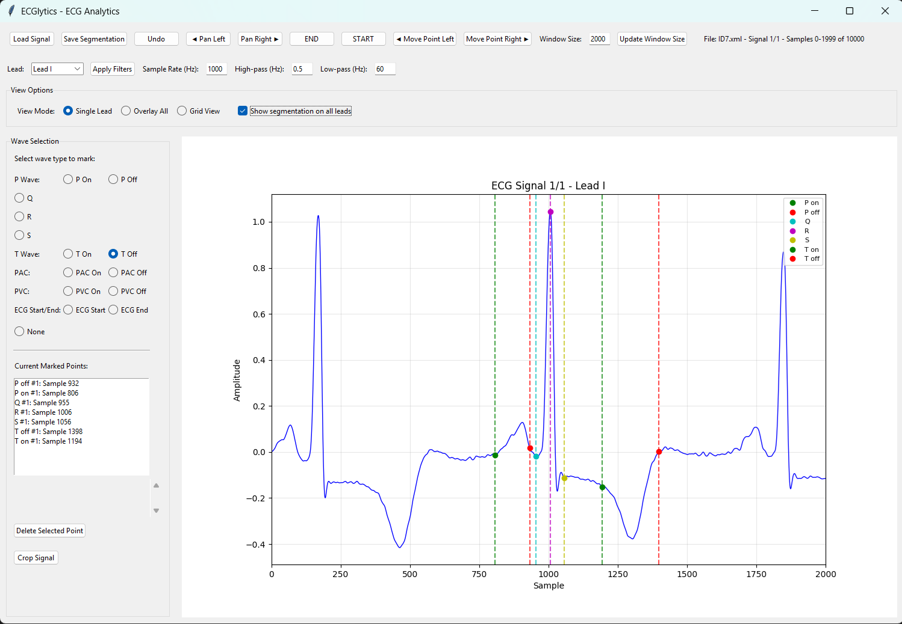

# ECGlytics - ECG Segmentation Tool

A  GUI application for ECG signal analysis, segmentation, and visualization. Built with Python and Tkinter, this tool provides an interface for loading, filtering, and manually segmenting ECG signals across multiple leads and formats.



## Features

### Signal Loading & Format Support
- **Multiple file formats**: `.mat`, `.npy`, `.txt`, `.csv`, `.ecg` (ISHNE), `.xml` (GE MUSE/Mortara)
- **Multi-lead support**: Single lead to 12-lead ECG signals
- **Automatic format detection**: Intelligent parsing of different ECG data structures

### Visualization Options
- **Three view modes**:
  - **Single Lead**: Focus on one lead at a time
  - **Overlay**: All leads displayed together with vertical offsets
  - **Grid View**: Each lead in its own subplot
- **Configurable window size**: Adjustable sample window (default: 1000 samples)
- **Pan navigation**: Move through long recordings efficiently

### Signal Processing
- **Digital filtering**: Built-in high-pass and low-pass filters
- **Configurable parameters**: Adjustable sample rates and filter frequencies
- **Real-time filtering**: Apply filters and see results immediately

### Manual Segmentation
- **Comprehensive wave marking**:
  - P wave (onset/offset)
  - Q, R, S waves
  - T wave (onset/offset)
  - PAC/PVC detection (onset/offset)
  - ECG start/end points for cropping
- **Point management**:
  - Click-to-mark interface
  - Point selection and movement with arrow keys
  - Undo functionality
  - Delete individual points
- **Multi-lead segmentation**: Show/hide segmentation across all leads

### Data Management
- **Export options**: Save segmentation data as `.npy`, `.json`, or `.csv`
- **Signal cropping**: Extract segments based on marked start/end points
- **Batch processing**: Handle multiple signals in sequence

## Installation

### Prerequisites
```bash
pip install -r requirements.txt
```

### Setup
1. Clone the repository:
```bash
git clone https://github.com/BME-Jafar/ECGlytics
cd ECGlytics
```

2. Ensure all required files are present:
```
ECGLab.py
filter.py
xml_parser.py
```

3. Run the application:
```bash
python ECGLab.py
```

## Usage

### Loading ECG Data
1. Click **"Load Signal"** to open file browser
2. Select your ECG file (supported formats: `.mat`, `.npy`, `.txt`, `.csv`, `.ecg`, `.xml`)
3. The application automatically detects signal dimensions and lead count

### Navigation
- **Pan Left/Right**: Move through the signal in half-window increments
- **START/END**: Jump to beginning or end of signal
- **Window Size**: Adjust the number of samples displayed (default: 1000)

### Filtering
1. Set **Sample Rate** (Hz)
2. Configure **High-pass** frequency (default: 0.5 Hz)
3. Configure **Low-pass** frequency (default: 60 Hz)
4. Click **"Apply Filters"**

### Segmentation Workflow
1. **Select wave type** from the radio buttons (P On/Off, Q, R, S, T On/Off, PAC, PVC, ECG Start/End)
2. **Click on the signal** at the desired sample point
3. **Review marked points** in the side panel
4. **Move points** using:
   - Select point from list → Use arrow keys or Move Point buttons
   - **Undo** recent actions
   - **Delete** individual points

### View Options
- **Single Lead**: Focus on one lead, switch using dropdown
- **Overlay**: See all leads together with offsets
- **Grid View**: Individual subplots for each lead
- Toggle **"Show segmentation on all leads"** for cross-lead reference

### Saving Results
- **Save Segmentation**: Export marked points as `.npy`, `.json`, or `.csv`
- **Crop Signal**: Extract signal segments between start/end points

## File Format Details

### Supported Input Formats
- **MATLAB (.mat)**: Expects ECG data with optional 'fs' sampling rate
- **NumPy (.npy)**: Python pickle format
- **Text/CSV (.txt, .csv)**: Comma-separated values
- **ISHNE (.ecg)**: Standard ECG format with header parsing
- **XML (.xml)**: GE MUSE and Mortara formats

### Output Formats
- **NumPy (.npy)**: Preserves data types and structure
- **JSON (.json)**: Human-readable, cross-platform
- **CSV (.csv)**: Includes signal index, lead index, wave type, and sample position

## Architecture

### Core Components
- **ECGLabApp**: Main application class
- **Signal Management**: Multi-format loading and preprocessing
- **Visualization Engine**: Three rendering modes with matplotlib
- **Segmentation Engine**: Point marking, selection, and management
- **Filter Pipeline**: Real-time signal processing

### Key Methods
- `load_signal()`: Multi-format file loading
- `update_plot()`: Rendering based on view mode
- `on_plot_click()`: Interactive point marking
- `apply_filters()`: Signal processing pipeline
- `crop_signal()`: Export segmented regions

## Keyboard Shortcuts
- **Left Arrow**: Move selected point left
- **Right Arrow**: Move selected point right

## Contributing

### Code Structure
The application follows a modular design:
- GUI components are separated by functionality
- Signal processing is abstracted into filter modules
- File I/O supports extensible format handlers

### Adding New Features
1. **File Formats**: Extend the `load_signal()` method
2. **Wave Types**: Add to wave selection radio buttons and color mapping
3. **Filters**: Implement in `filter.py` and integrate in `apply_filters()`


## License

This project is open source. Please refer to the LICENSE file for details.
